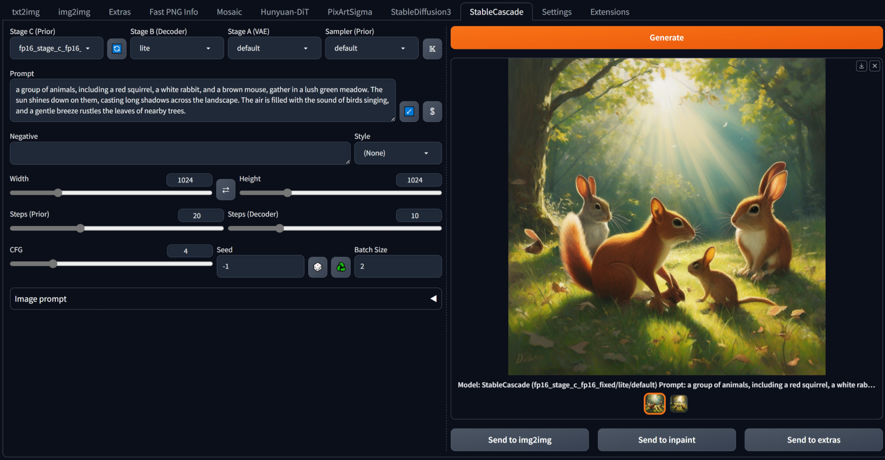
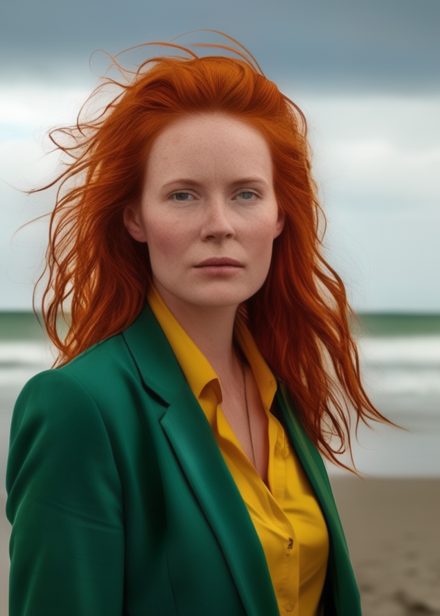

## Stable Cascade for webui ##
### Forge tested, A1111 too ###
### works for me TM on 8GB VRAM, 16GB RAM (GTX1070) ###

---
## Install ##
Go to the **Extensions** tab, then **Install from URL**, use the URL for this repository.

In the webUI directory there is a file called `requirements_versions.txt`, look for the line `diffusers==0.25.0` (probably the last line) and edit it to `diffusers>=0.28.1`. If the line doesn't exist, just add it. Fully restart the webUI; the newer version will be installed on update. 

At your own risk. This is ~~moderately~~ reasonably tested, but only on my computer.
Models will be downloaded automatically, on demand. I only use the 16 bit models.

>[!NOTE]
> Older graphics cards, like mine, don't support bfloat16 and the large prior model is not compatible with float16. The smaller 'lite' model works, but is noticeably worse quality. There is a patched model by [Shih-Ying Yeh / KohakuBlueLeaf](https://huggingface.co/KBlueLeaf/Stable-Cascade-FP16-fixed/tree/main) which must be put directly into the `{webui}\models\diffusers\StableCascadeCustom\StageC` directory (you'll need to create this directory structure). Results are a little different, but it works. Using the fixed version is optional. Using light models is optional. Other custom checkpoints are available.

---

Change log

#### 13/08/2024 ####
* added **SoteDiffusion v2** by [Disty](https://huggingface.co/Disty0) to the models list
* **fp16** toggle button forces usage of float16, even if bfloat16 if available. Disabled means automatic selection based on Torch, preferring bfloat16 as that's what the official weights use. Sote Diffusion weights are fp16.
* added scheduler for decoder (stage B). Didn't include this previously as it has relatively little effect.
* tweaked UI so it works better with Gradio4

#### 27/07/2024 ####
* added possible mis-feature of using image embeds as negatives
* added option to keep models in memory. Saves load time, which could be important if running from a slow hard drive. With Cascade, this seems like a good option to always have enabled and may become default behaviour in a later update.
* also button to force unload models

#### 24/07/2024 ####
* added SuperPrompt button (ꌗ) to rewrite simple prompts with more detail. This **overwrites** the prompt. Read about SuperPrompt [here](https://brianfitzgerald.xyz/prompt-augmentation). Credit to BrianFitzgerald for the model. (all my alternate model extensions are updated to use this; the model is loaded to a shared location so there's no wasted memory due to duplicates.)

#### 10/07/2024 ####
* improved yesterday's effort. More compatibility, multi-line, etc.

#### 09/07/2024 ####
* added prompt parsing to automatically fill in details like seed, steps, etc.

#### 18/06/2024 ####
Added a second image input.

Fixed 'clip_sample' error with non-default schedulers.

#### 11/06/2024 ####
Added support for custom Diffusers type checkpoints: edit 'modelsListSC.py' in the extension directory. **SoteDiffusion** by [Disty](https://huggingface.co/Disty0) is included as an example (~8GB for prior and trained text encoder, ~3GB for (optional, but recommended) decoder). It's a full model anime finetune, seems good, and has the extra bonus of working in float16. The styles list has an updated entry with the suggested prompt additions for this model - they seem necessary.

#### 07/06/2024 ####
fix for CFG 1: previously decoder stage had guidance set to 1.1 and would error. Now decoder stage uses guidance 1 (no significant difference to results).

updated handling for custom models to work with updated diffusers. *from_single_file* was overhauled and the new implemention needs model configs passed to it, otherwise it fails. Doesn't fail on first run though, that would be too easy to spot. Why not just stick to diffusers 0.27 for now?  Because PixArt needs 0.28.0, Hunyuan-DiT needs 0.28.1, and I want to run all in one Forge install.

#### 25/05/2024 ####
Fixed get image source from gallery, fixed batch size for image source, add model details to infotext.

#### 18/05/2024 ####
Added a refresh button to recheck custom checkpoints

Added check for bfloat16 support, and uses it if available. Otherwise, float16 as before. Previously, forcing float16 meant that the original full stage C model wouldn't work for anyone. I can't fully test this, but it does correctly fall back to float16 for me.

Seem to have made generations fully deterministic by regenerating the Generator.

#### 17/05/2024 ####
Custom singlefile checkpoints will be searched on startup in `models\diffusers\StableCascadeCustom\StageC` and `models\diffusers\StableCascadeCustom\StageB`. There are a handful of these on civitAI: countersushi is a lite stage C model that seems to show considerable improvement over the base. The full models may require bfloat16, so don't work for me (black images only).
If you use the fixed fp16 prior, you'll need to move it into the custom stageC directory.

---
freshly outdated screenshot

---
Image prompt is not image to image, it acts as a style/theme guide.

---
Prompt: cinematic photo breathtaking natural landscape with majestic snowcapped mountain range in background, with crystal clear blue lake in foreground, golden light sunrise, warm glow, verdant plants and colorful wild flowers . 35mm photograph, film, bokeh, professional, 4k, highly detailed

Negative: drawing, painting, crayon, sketch, graphite, impressionist, noisy, blurry, soft, deformed, uglycartoon, drawing, sketch, 2d

---

---
Thanks to:
[frutiemax92](https://github.com/frutiemax92) for inference_pipeline.py, which helped learn how to put diffusers together

[benjamin-bertram](https://github.com/benjamin-bertram/sdweb-easy-stablecascade-diffusers) for ui details
