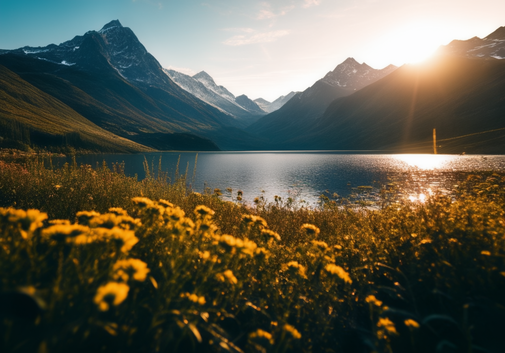

## Stable Cascade for webui ##
### Forge tested, probably A1111 too ###
I don't think there is anything Forge specific here.
### works for me TM on 8Gb VRAM, 16Gb RAM (GTX1070) ###

---
### 17/05/2024 ###
Custom singlefile checkpoints will be searched on startup in `models\diffusers\StableCascadeCustom\StageC` and `models\diffusers\StableCascadeCustom\StageB`. There are a handful of these on civitAI: countersushi is a lite stage C model that seems to show considerable improvement over the base. The full models require bfloat16, so don't work for me (black images only).
If you use the fixed fp16 prior, you'll need to move it into the custom stageC directory.

### 18/05/2024 ###
Added a refresh button to recheck custom checkpoints

Added check for bfloat16 support, and uses it if available. Otherwise, float16 as before. Previously, forcing float16 meant that the original full stage C model wouldn't work for anyone. I can't fully test this, but it does correctly fall back to float16 for me.

Seem to have made generations fully deterministic by regenerating the Generator.

---

---
At your own risk. This is moderately tested, but only on my computer.
Models will be downloaded automatically, on demand. I only use the 16 bit models. Note that older graphics cards, like mine, don't support bfloat16 and the large prior model is not compatible with normal float16. The smaller model works, but is noticeably worse quality. There is a patched file [here](https://huggingface.co/KBlueLeaf/Stable-Cascade-FP16-fixed/tree/main) which must be put directly into the `models\diffusers\StableCascadeCustom\StageC` directory. Results are a little different, but it works. Using the fixed version is optional. Using light models is optional.

Image prompt is not image to image, it acts as a style/theme guide.

---
Prompt: cinematic photo breathtaking natural landscape with majestic snowcapped mountain range in background, with crystal clear blue lake in foreground, golden light sunrise, warm glow, verdant plants and colorful wild flowers . 35mm photograph, film, bokeh, professional, 4k, highly detailed

Negative: drawing, painting, crayon, sketch, graphite, impressionist, noisy, blurry, soft, deformed, uglycartoon, drawing, sketch, 2d

---
To do?:
	
controlnet

---
Thanks to:
	[frutiemax92](https://github.com/frutiemax92) for inference_pipeline.py, which helped learn how to put diffusers together

	[benjamin-bertram](https://github.com/benjamin-bertram/sdweb-easy-stablecascade-diffusers) for ui details